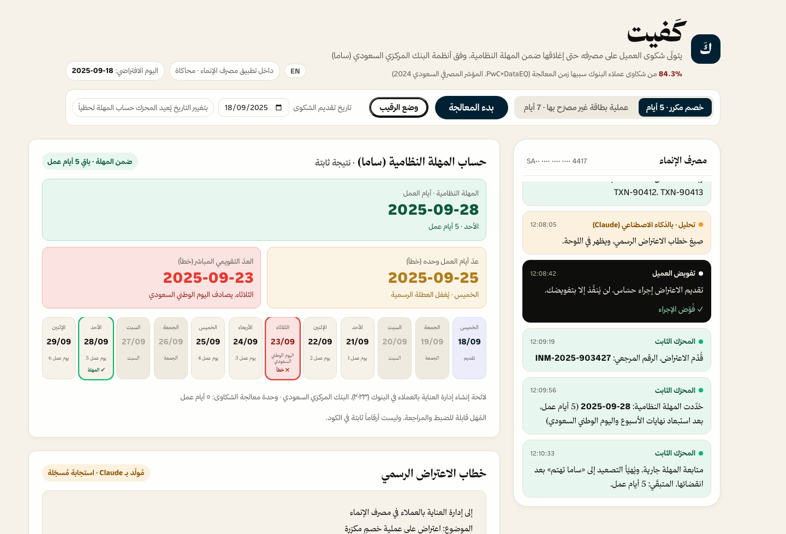
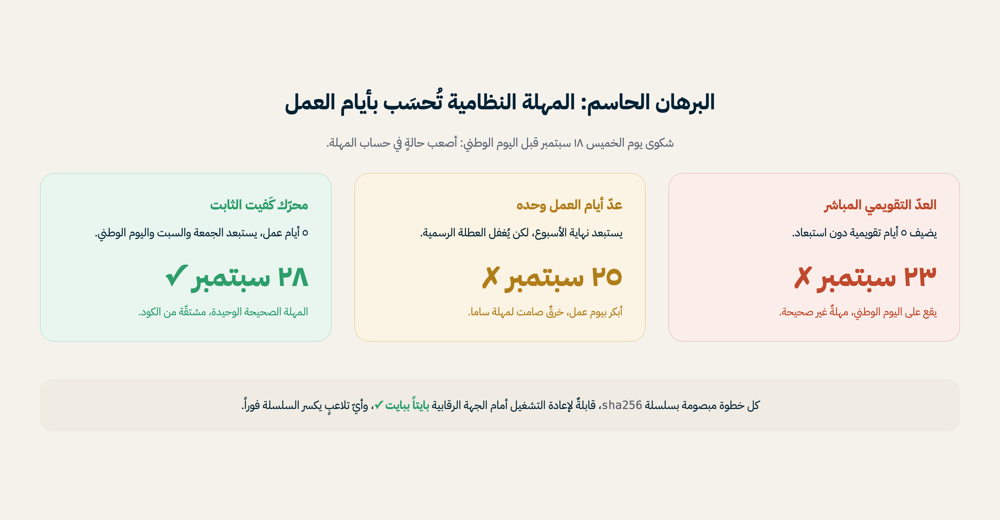
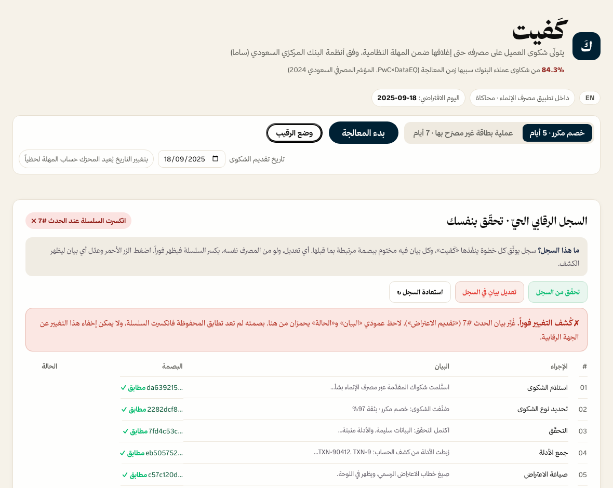
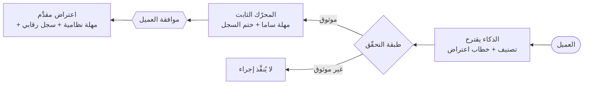
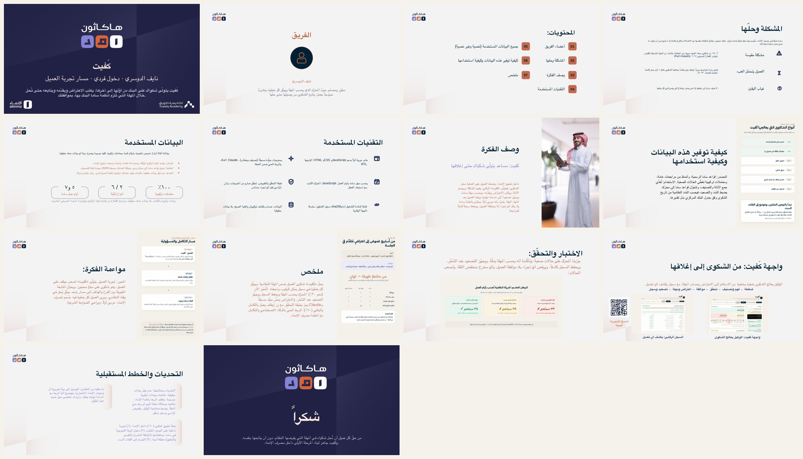

<div dir="rtl">

# كَفيت · Kafeet

</div>

<p align="center">
  <a href="https://app-nu-seven-90.vercel.app"></a>
  
  
  
  
</p>

<div dir="rtl">

### كَفيت يتولّى شكوى عميل مصرف الإنماء من أوّلها إلى آخرها: يكتب الاعتراض، ويقدّمه، ويتابعه حتى تُحل خلال المهلة التي تُلزم أنظمة ساما البنك بها، بموافقة العميل وبسجل يكشف أي تعديل.

مساعد يعمل داخل تطبيق مصرف الإنماء، يعالج شكوى العميل بدل الاكتفاء بالرد عليه. الذكاء الاصطناعي يقترح، ومحرّك ثابت يقرّر ويوثّق، والعميل يأذن قبل أي إجراء على ماله.

> النموذج منشور ويعمل: **[app-nu-seven-90.vercel.app](https://app-nu-seven-90.vercel.app)**
>
> هاكاثون أمد ٢٠٢٦ (أكاديمية طويق ومصرف الإنماء) · مسار تجربة العميل · دخول فردي، نايف الدوسري

</div>



---

<div dir="rtl">

## ما الذي يميّز كَفيت

أغلب حلول الذكاء الاصطناعي تكتفي بالرد على العميل. كَفيت يعالج الشكوى فعلاً حتى إغلاقها، ويفصل بين ما يقترحه الذكاء وما يقرّره المحرّك الثابت، فلا يلمس الذكاءُ مالَ العميل. وكل ما يلي مطبَّق في الكود، ويمكن تشغيله والتحقّق منه:

## ١) محرّك حساب المهلة

أصعب حالة في حساب مهلة ساما: شكوى يوم الخميس ١٨ سبتمبر قبل اليوم الوطني (الثلاثاء ٢٣ سبتمبر). الحساب الخاطئ يفوّت على العميل موعد التصعيد، أو يستعجله قبل أوانه. المحرّك يحسبها من الكود مباشرة:

</div>

```bash
node -e '
  global.window = {}; require("./app/engine.js");
  const r = window.KAFEET_ENGINE.computeDeadline({
    filedAt: "2025-09-18T11:30:00+03:00", ruleType: "A_5",
    samaRules: { A_5: { workingDays: 5, citationAr: "x" } },
    holidays: [{ date: "2025-09-23", nameAr: "اليوم الوطني السعودي" }],
    assumedNow: "2025-09-18T12:05:00+03:00",
  });
  console.log("naive calendar +5 :", r.naive.date);      // 2025-09-23  X يقع على اليوم الوطني
  console.log("working-days only  :", r.semiNaive.date);  // 2025-09-25  X يغفل العطلة الرسمية
  console.log("Kafeet engine      :", r.computedDeadline);// 2025-09-28  المهلة الصحيحة
'
```

<div dir="rtl">

ثابت بالكامل: بلا `Date.now()` وبلا عشوائية، والمنطقة الزمنية مثبّتة على `Asia/Riyadh`. نفس المُدخل يعطي نفس المُخرج دائماً.



## ٢) السجل الرقابي

كل خطوة يتخذها الوكيل على مال العميل مختومة بسلسلة `sha256` مرتبطة بختم الخطوة السابقة. في النموذج: اضغط «بدء المعالجة» وفوّض الإجراء، ثم افتح «وضع الرقيب» واضغط «تعديل بيانٍ في السجل»، فتنكسر السلسلة عند الحدث المعدَّل، ويظهر التعديل في عمودي «البيان» و«الحالة».

أي تعديل يظهر فوراً، حتى من البنك نفسه.



## ٣) معمارية «يقترح / يقرّر»

| الطبقة | الدور | التطبيق في الكود |
|---|---|---|
| **الذكاء (يقترح)** | يفهم الشكوى، ويصنّفها، ويصوغ خطاب الاعتراض | مخرجات `Claude` مولّدة مسبقاً وموسومة |
| **طبقة التحقّق** | ترفض التصنيف خارج القائمة، والدليل غير الموجود في الكشف، والثقة دون الحد | `validateIntelligence()` |
| **المحرّك الثابت (يقرّر ويوثّق)** | يحسب المهلة، ويضبط التصعيد، ويختم السجل | `computeDeadline()` · `createAuditLog()` |
| **العميل (يأذن)** | لا يُنفَّذ أي إجراء حسّاس إلا بموافقته | بوابة الموافقة الإلزامية |

</div>



<div dir="rtl">

الفصل بين «يقترح» و«يقرّر» مطبَّق في الكود، من غير أن يفقد كَفيت استقلاله: يدير الشكوى من استلامها إلى إغلاقها، ولا يمضي في أي خطوة تمسّ مال العميل إلا بإذنه.

</div>

---

<div dir="rtl">

## المشكلة

سارة عميلة في مصرف الإنماء، خُصِم منها مبلغ عملية واحدة مرّتين. مالها محجوز، وتتابع شكواها بنفسها بين الاتصالات والفرع والنماذج، أسابيع دون أن تعرف ما جرى ودون مرجع ترجع إليه.

- **٨٤٫٣٪** من شكاوى عملاء البنوك سببها **زمن المعالجة** ([`PwC × DataEQ`، مؤشر القطاع المصرفي السعودي ٢٠٢٤](https://www.pwc.com/m1/en/publications/banking-sentiment-index/ksa-banking-sentiment-index-2024.html)).
- البنك **ملزم نظاماً** بمعالجة الشكوى خلال **٥ أيام عمل** ([لائحة إنشاء إدارة العناية بالعملاء في البنوك ٢٠٢٣، البنك المركزي السعودي](https://rulebook.sama.gov.sa/en/regulations-establishing-customer-care-departments-banks)).

## الحل

كَفيت يحوّل المتابعة اليدوية متعددة الخطوات إلى معالجة موثّقة تُغلق فيها الشكوى ضمن المُدد النظامية: فهم، فتصنيف، فصياغة اعتراض برقم مرجعي، فضبط مهلة، فتهيئة تصعيد إلى «ساما تهتم» يرفعه العميل بعد المهلة، وكلها فوق سجل رقابي يظهر فيه أي عبث فور وقوعه.

## لماذا مصرف الإنماء

بحسب شروط هاكاثون أمد، هذا الحل مبني لمصرف الإنماء تحديداً: يقلّل زمن معالجة الشكاوى، ويحافظ على التزام المصرف بمهل ساما، ويوثّق كل خطوة للرقيب. يبدأ بتجربة داخلية في الإنماء ثم يتوسّع تدريجياً. وهوية النموذج والعرض تعتمد ألوان مصرف الإنماء الرسمية.

</div>

## التشغيل محلياً · Run locally

```bash
# بلا تبعيات، ملفات HTML/JS فقط
cd app
python3 -m http.server 4173
# ثم افتح http://localhost:4173
```

<div dir="rtl">

أوضاع العرض عبر مُعاملات الرابط: `?lang=en` للإنجليزية · `?shot=run` للتشغيل الفوري · فتح «وضع الرقيب» وتجربة «تعديل بيانٍ في السجل».

## الإفصاح الكامل

نذكره صراحة:

- **مولّد مسبقاً:** لا نداء لنموذج لغوي وقت التشغيل في هذه المرحلة. مخرجات التصنيف وخطاب الاعتراض مولّدة بـ`Claude` مسبقاً ومضمّنة كبيانات ثابتة موسومة، وتمر عبر طبقة التحقّق قبل التسليم.
- **بيانات تركيبية بالكامل**، بلا بيانات عملاء حقيقية (حساب وكشف بصيغ واقعية).
- **نحو ٣٠٪ مبني** (المسار الأساسي يعمل كاملاً على نوعين مثبَتين، وأربعة مهيّأة)، و**٧٠٪ خطة تطبيق** من ثلاث مراحل:
  1. تجربة داخلية في الإنماء على النوعين المثبَتين.
  2. دخول البيئة التجريبية في ساما، ومتطلباتها (الموافقة البشرية والتفسير والتدقيق) مطبّقة لدينا.
  3. التوسّع إلى الفئات الست.
- **الجانب الشرعي:** عند تعليق المبلغ محل النزاع لا تُحتسب فائدة ولا رسوم تأخير. إشارة موثّقة تناسب طبيعة المنتج الإسلامي، ولا تُعدّ فتوى.
- **هذا المستودع نسخة منقّحة** أُعدّت للتسليم، والتطوير جرى في مساحة عمل خاصة قبل النشر.

## التقنيات

`HTML/JS` بلا تبعيات · محرّك ثابت · `sha256` مدمج لسلسلة التدقيق · خط «ثمانية» العربي · واجهة عربية أولاً بدعم `RTL` · منشور على `Vercel`.

الخطوط في `app/fonts` ملك شركة ثمانية وتخضع لشروط استخدامها المعلنة، وليست مشمولة برخصة MIT الخاصة بهذا المستودع؛ مضمّنة لأغراض العرض فقط.

</div>

| الملف | المحتوى |
|---|---|
| [`app/engine.js`](./app/engine.js) | المحرّك الثابت: حساب المهلة، وطبقة التحقّق، وسلسلة `sha256` |
| [`app/data.js`](./app/data.js) | بيانات تركيبية، وقواعد ساما، ومخرجات `Claude` المولّدة مسبقاً |
| [`app/app.js`](./app/app.js) | الواجهة، وتدفّق الوكيل، والسجل الرقابي |
| [`presentation/`](./presentation/) | العرض التقديمي (١٤ شريحة) |
| [`screenshots/`](./screenshots/) | لقطات النموذج والعرض |

<div dir="rtl">

## العرض التقديمي



العرض الكامل (١٤ شريحة): [`presentation/كفيت-العرض.pptx`](./presentation/كفيت-العرض.pptx) · نسخة `PDF` للمعاينة المباشرة: [`presentation/كفيت-العرض.pdf`](./presentation/كفيت-العرض.pdf)

## المطوّر

نايف الدوسري، مطوّر ومصمّم. بنى محرّك المعالجة الثابت، ونشر نموذجاً عاملاً يغطّي مسار الشكوى من استلامها إلى إغلاقها. دخول فردي.

</div>
