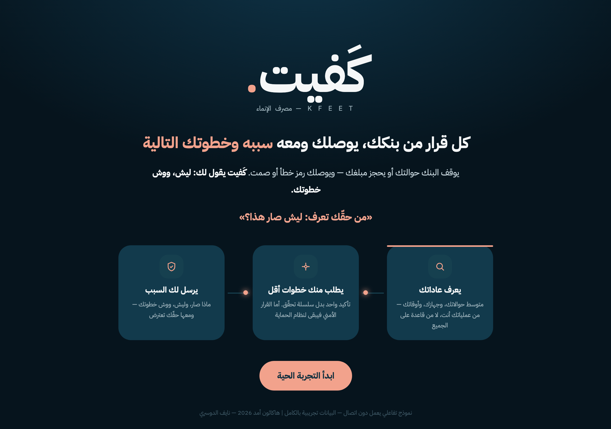
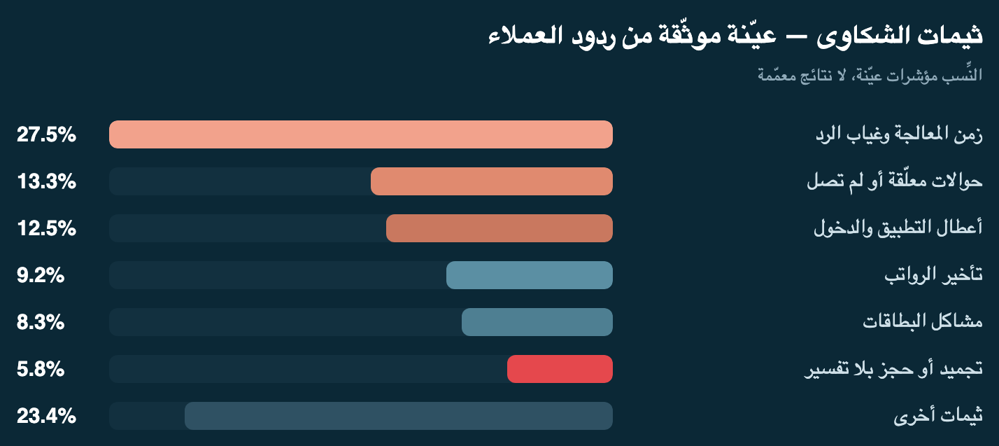
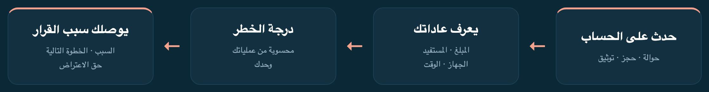
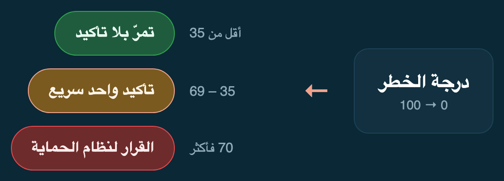
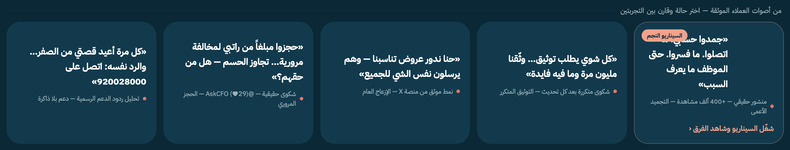
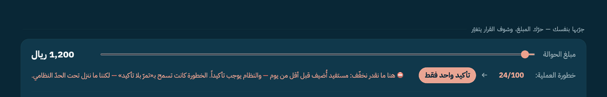
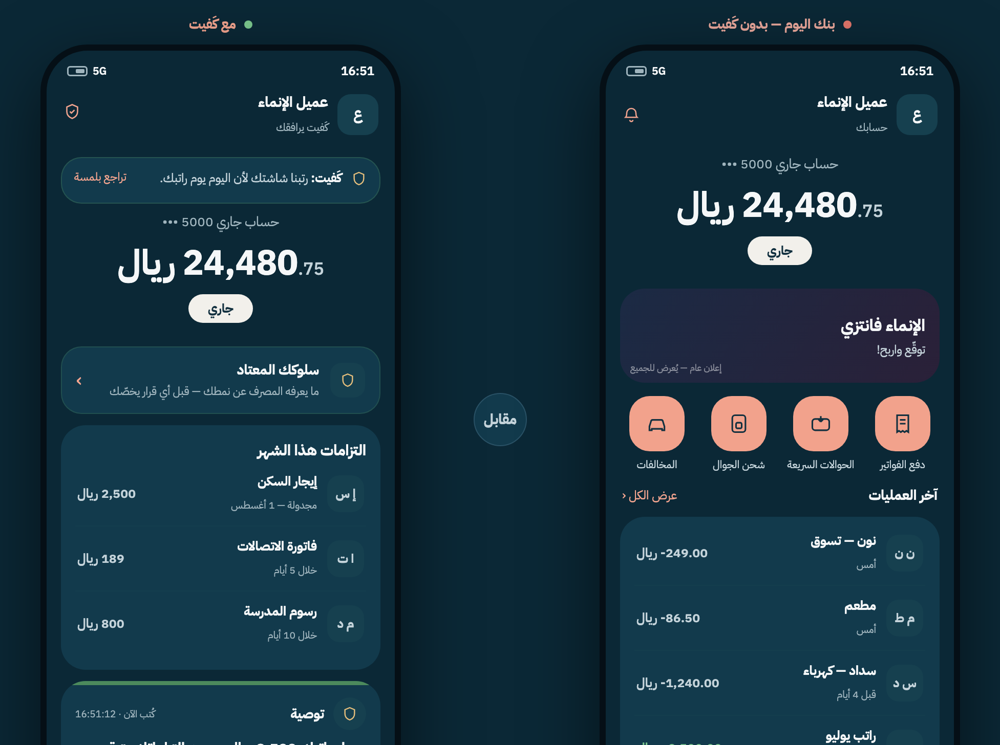
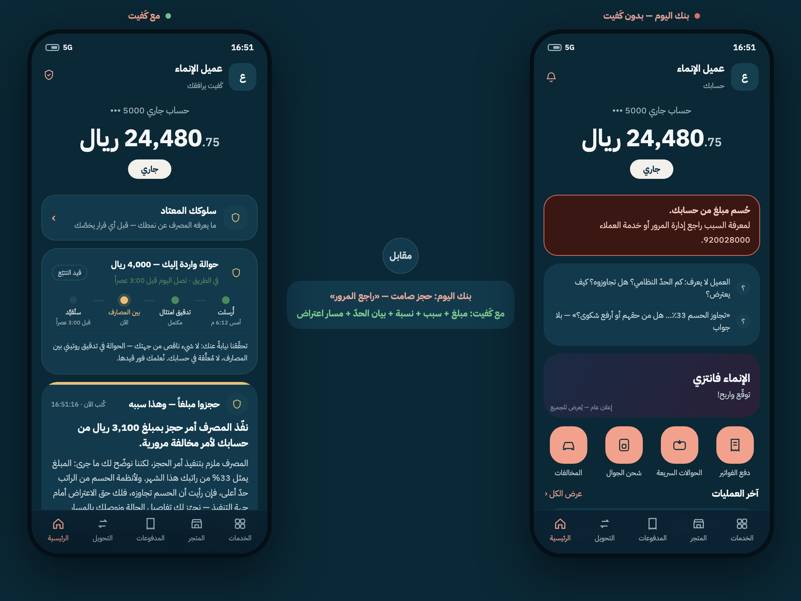
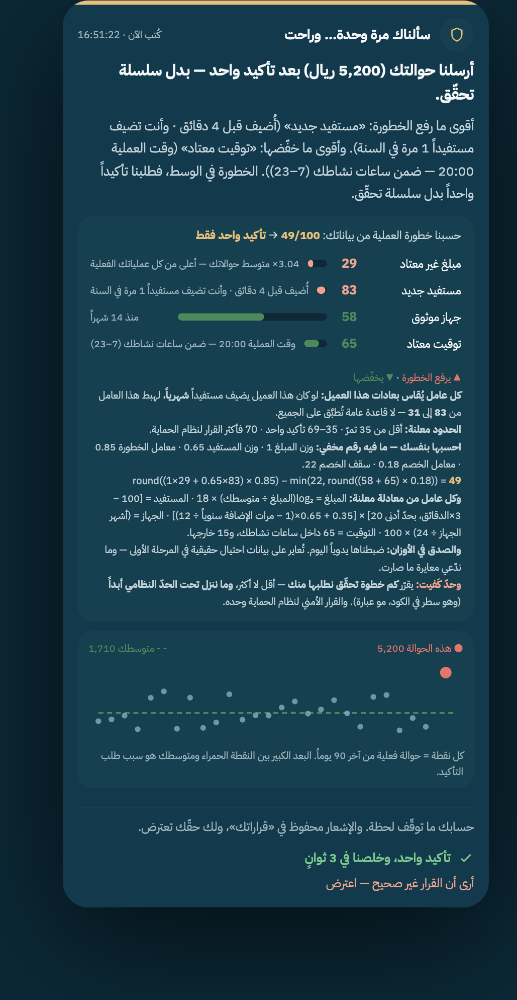

# كَفيت · Kafeet

**يقول لك سبب كل قرار يمسّ حسابك.**

<b>TL;DR</b> — Kafeet is a transparency layer inside a bank app. When the bank freezes a transfer or holds an amount, Kafeet tells the customer <b>why</b> and <b>what to do next</b> — and asks for fewer verification steps when the activity looks normal.

---

## المحتويات

- [المشكلة](#المشكلة)
- [الحل](#الحل)
- [وش سوّينا](#وش-سوّينا)
- [وش يميّزنا](#وش-يميّزنا)
- [القيمة](#القيمة)
- [المميزات](#المميزات)
- [التقنيات](#التقنيات)
- [التشغيل](#التشغيل)
- [خارطة الطريق](#خارطة-الطريق)
- [عن المشروع](#عن-المشروع)

---

## المشكلة

يوقف البنك حوالتك، أو يحجز مبلغاً من حسابك، أو يطلب توثيقاً — فيوصلك **رمز خطأ أو صمت**. حتى موظف البنك قد لا يعرف السبب.

> «حجزوا من راتبي ثمانية آلاف ريال… تجاوز الحسم ٣٣٪… هل من حقهم؟»
> — عميل مصرف الإنماء على منصّة `X`

وهو ليس وحده. حلّلنا عيّنة موثّقة من ردود عملاء الإنماء، فكان **زمن المعالجة وغياب الرد** أعلى الشكاوى، تليه **الحوالات المعلّقة** التي لا يعرف صاحبها أين وصلت:

المشكلة ليست أن البنك يتصرّف — بل أنه يتصرّف **بصمت**.

---

## الحل

كَفيت إضافة داخل تطبيق الإنماء. يخلّي البنك **يقول لك ليش** اتُّخذ القرار وما خطوتك، ويطلب منك **خطوات تأكيد أقل** لو عمليتك معتادة — بينما **القرار الأمني يبقى للبنك**.

**وله حدٌّ واضح:** كَفيت لا يلغي حجزاً، ولا يفتح عمليةً أوقفها البنك. يقرّر شيئاً واحداً: كم خطوة تأكيد يطلب منك — أقل لا أكثر، وفوق الحدّ النظامي دائماً.

**نطاق الشرح:** كَفيت يشرح قرارات الاحتيال والخدمة — ما يحقّ ويجب شرحه للعميل. أما قرارات الالتزام التي يمنع النظام الإفصاح عنها (مثل مكافحة غسل الأموال) فخارج نطاقه تماماً وعن قصد؛ ومعرفة أين يتوقّف الشرح جزءٌ من احترام النظام.

يحسب درجة خطر من عمليات العميل نفسه، ثم يقرّر عدد خطوات التحقّق عبر ثلاثة حدود معلنة:

| المكوّن | ماذا يفعل |
|---|---|
| **يعرف عاداتك** | متوسط حوالاتك وجهازك وأوقاتك — من عملياتك وحدها |
| **يوصلك سبب القرار** | السبب والخطوة التالية وحقّك في الاعتراض، بلغة واضحة |
| **خطوات تأكيد أقل** | كلما كانت عمليتك معتادة، قلّت خطوات التأكيد |
| **شاشة تناسب حالك** | الشاشة تتغيّر مع حالك: يوم راتب، سفر، ضيقة مالية |
| **قصتك تنتقل معك** | تبدأ شكوتك في التطبيق وتكمّلها في الفرع؟ يلقونها جاهزة — ما تعيد حكايتك من الصفر |

---

## وش سوّينا

كَفيت منتج كامل — لا حالة واحدة. خمسة سيناريوهات من شكاوى حقيقية: **التجميد · الحجز · التوثيق · العروض · الدعم**.

وكل شيء حيّ: حرّك مبلغ الحوالة، وشاهد درجة الخطر تُحسب أمامك والقرار يتبدّل — من «تمرّ» إلى «تأكيد» إلى «القرار للبنك».

<table dir="rtl">
  <tr>
    <td width="50%"></td>
    <td width="50%"></td>
  </tr>
  <tr>
    <td align="center">نفس اللحظة، شاشتان — كَفيت مقابل بنك اليوم</td>
    <td align="center">الحجز المروري: «هل من حقهم؟» يُجاب</td>
  </tr>
</table>

 نفس الإشعار مكشوفاً بكل تفاصيله لفريق البنك

---

## وش يميّزنا

مسحنا **١٤ جهة مصرفية سعودية** بحثاً عن جهة تشرح قرارها الآلي للعميل — فلم نجد. البنوك تخصّص الإعلانات والعروض؛ كَفيت يخصّص طريقة تعامل البنك مع عمليتك، ثم يشرحها لك:

| القدرة | بنوك اليوم | كَفيت |
|---|:---:|:---:|
| يشرح سبب القرار الآلي للعميل | ✗ | ✓ |
| خطوة تالية وحق اعتراض داخل الإشعار | ✗ | ✓ |
| عوامل محسوبة من بيانات العميل نفسه | ✗ | ✓ |
| تخفيف خطوات التحقّق للعميل المعتاد | ✗ | ✓ |

---

## القيمة

| ⏱️ وقت العميل | 📉 تكاليف البنك | 💬 الشكاوى |
|:---:|:---:|:---:|
| **فوري** | **٣٠–٤٠٪** | **٨٤٪** |
| من أسابيع متابعة إلى تفسير فوري | خفض مكالمات هذه الفئة `[مستهدف]` | من شكاوى **قطاع** البنوك السعودي مردّها بطء المعالجة `[متحقّق]` |

الوسوم: `[مستهدف]` نقيسه في التجربة، و`[متحقّق]` من مؤشر `PwC×DataEQ 2024`‏. ومخطط الشكاوى أعلاه من **عيّنتنا** نحن، لا من المؤشر.

---

## المميزات

- **يوصلك السبب فوراً** — بدل رمز خطأ أو انتظار مكالمة.
- **خطوات تحقّق أقل** حين تكون عمليتك معتادة — لا تجميد للحساب.
- **العوامل محسوبة من عملياتك أنت** — بحسب عاداتك، لا قاعدة على الجميع.
- **شاشتان** — العميل يرى سبباً بسيطاً، وفريق البنك يرى كل الأرقام.
- **حقّ الاعتراض** جزء من كل إشعار، بضغطة.
- **يعمل بلا إنترنت** — العرض لا يسقط بانقطاع الشبكة.

---

## التقنيات

**بدأنا بالأصعب في المصرفية — الشفافية — لأن بنكاً لا يقدر يشرح قراره لا ينشره.**

<table dir="rtl">
  <tr>
    <th width="50%">الآن — نموذج أوّلي</th>
    <th width="50%">المستقبل — الإنتاج</th>
  </tr>
  <tr>
    <td valign="top">

- محرك قواعد واضح تقدر تدقّقه.
- مبنيٌّ بـ `HTML` و`CSS` و`JavaScript` فقط — بلا مكتبات ولا أدوات بناء.
- يعمل بلا إنترنت، بخطوط محلية.
- كل عامل نسبيٌّ لتاريخ العميل نفسه.

</td>
    <td valign="top">

- نماذج سلوكية وذكاء لحظي (فئة `Feedzai`/`BioCatch`).
- تكامل المصرفية المفتوحة.
- معايرة على بيانات حقيقية.
- **بنفس واجهة الشرح.**

</td>
  </tr>
</table>

هوية عربية `RTL` بلونَي مصرف الإنماء الكحلي والمرجاني. والبيانات في النموذج **تجريبية بالكامل**.

---

## التشغيل

جرّب كَفيت الآن مباشرة من متصفّحك — بضغطة، بلا تحميل:

### ▶ [na2faldosari.github.io/kafeet/prototype](https://na2faldosari.github.io/kafeet/prototype/index.html)

الأفضل من لابتوب لتشوف الهاتفين جنباً إلى جنب. اضغط «ابدأ التجربة»، جرّب السيناريوهات، ثم اسحب شريط المبلغ وشوف القرار يتغيّر أمامك.

---

## خارطة الطريق

- **٩٠ يوماً — `MVP`:** قناة واحدة + لوحة قياس. المقياس: أوّل عميل يوصله سبب قراره، ورقم مكالمات قبل/بعد.
- **السنة الأولى — التوسّع:** بقية قنوات الإنماء + ترقية للنماذج السلوكية. المقياس: خفض مكالمات موثّق.
- **الرؤية — الترخيص:** كَفيت إضافة تشرح القرار لبنوك أخرى.

---

## عن المشروع

**من حقّ كل عميل أن يعرف لماذا اتُّخذ هذا القرار — وما خطوته التالية.**

[▶ الديمو الحيّ](https://na2faldosari.github.io/kafeet/prototype/index.html) · [العرض](https://na2faldosari.github.io/kafeet/presentation/) · [التشغيل](#التشغيل)

هاكاثون أمد 2026 · مسار تجربة العميل · مصرف الإنماء

صنعه **نايف الدوسري** — [MIT License](LICENSE)

